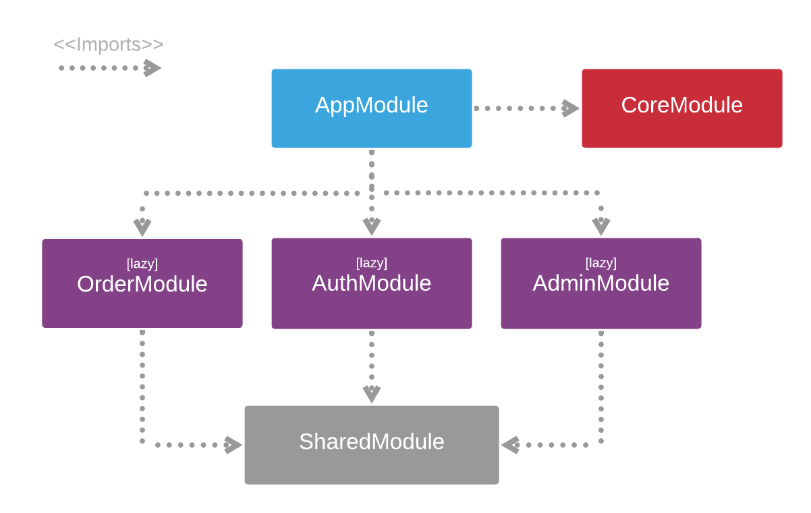

## 📖 About the project

This application is comics web store. it's possible to create, edit, update and delete each book.

## 🤖 Technologies

Technologies, design, patterns and packages that I used to develop this application.

- Front-end

  - [Angular 10](https://angular.io/)
    - [Angular Material 10.2.7](https://material.angular.io/)
    - [Angular Flex-Layout 11.0.0](https://www.npmjs.com/package/@angular/flex-layout)
    - [@auth0/angular-jwt](https://www.npmjs.com/package/@auth0/angular-jwt)
    - [RxJS 6.5](https://rxjs-dev.firebaseapp.com/guide/overview)
  - [SASS](https://sass-lang.com/)
    - [Flexbox](https://www.w3schools.com/css/css3_flexbox.asp)
    - [Grid Layout](https://www.w3schools.com/css/css_grid.asp)
    - [BEM Methodology](http://getbem.com/naming/)
  - [TypeScript 3.9](https://www.typescriptlang.org/)
  - NGX Packages
    - [Ngx Mask 11.1.4](https://www.npmjs.com/package/ngx-mask)
    - [Ngx Mat Select Search 3.1.4](https://www.npmjs.com/package/ngx-mat-select-search)
    - [Ngx Material File Input 2.1.1](https://www.npmjs.com/package/ngx-material-file-input)
  - Other Packages
    - [Cep Promise 4.0.3 ](https://www.npmjs.com/package/cep-promise)

- Back-end

  - [.NET Core 3.1 Web API](https://dotnet.microsoft.com/download)
  - [C#](https://docs.microsoft.com/en-us/dotnet/csharp/)
  - [Entity Framework Core 5](https://docs.microsoft.com/en-us/ef/core/)
  - [SQL Server](https://docs.microsoft.com/en-us/sql/sql-server/?view=sql-server-ver15)
  - Nuget Packages

    - [Microsoft.EntityFrameworkCore 5.0.0](https://www.nuget.org/packages/Microsoft.EntityFrameworkCore/5.0.0?_src=template)
    - [Microsoft.EntityFrameworkCore.Design 5.0.0](https://www.nuget.org/packages/Microsoft.EntityFrameworkCore.Design/5.0.0?_src=template)
    - [Microsoft.EntityFrameworkCore.Proxies 5.0.0](https://www.nuget.org/packages/Microsoft.EntityFrameworkCore.Proxies/5.0.0?_src=template)
    - [Microsoft.EntityFrameworkCore.Tools 5.0.0](https://www.nuget.org/packages/Microsoft.EntityFrameworkCore.Tools/5.0.0?_src=template)
    - [Microsoft.AspNetCore.Identity.EntityFrameworkCore 5.0.0](https://www.nuget.org/packages/Microsoft.AspNetCore.Identity.EntityFrameworkCore/5.0.0?_src=template)
    - [Predicate Builder 1.0.0](https://www.nuget.org/packages/PredicateBuilder/)
    - [Microsoft.AspNetCore.Mvc.Newtonsoft 3.1.10](https://www.nuget.org/packages/Microsoft.AspNetCore.Mvc.NewtonsoftJson/3.1.10?_src=template)
    - [Microsoft.AspNetCore.Authentication.JwtBearer 3.1.10](https://www.nuget.org/packages/Microsoft.AspNetCore.Authentication.JwtBearer/3.1.10?_src=template)
    - [Swashbuckle.AspNetCore 5.6.3](https://www.nuget.org/packages/Swashbuckle.AspNetCore/5.6.3?_src=template)

  - Development Approach
    - DDD - Domain Drive Design
    - SOLID Principles
    - Application Layers:
      - 1 - Application
      - 2 - Domain
      - 3 - Services
      - 4 - Infrastructure
      - 5 - Shared
  - Patterns and Resources Applied
    - Repository
    - Generic Repository
    - Generic Pagination
    - Unity Of Work
    - Facade
    - Factory
    - Command
    - Adapter

## Folder Structure

- Front-end

  |-- app

      |-- 🎯 core
          |-- [+] components
          |-- [+] pages
          |-- [+] guards
          |-- [+] models
          |-- [+] services
          |-- admin.module.ts
          |-- admin.routes.ts

      |-- 👨‍💼 admin (lazy 🦥)
          |-- [+] components
          |-- [+] models
          |-- [+] services
          |-- [+] pages
          |-- admin.module.ts
          |-- admin.routes.ts

      |-- 📦 order (lazy 🦥)
          |-- [+] components
          |-- [+] models
          |-- [+] services
          |-- [+] pages
          |-- admin.module.ts
          |-- admin.routes.ts

      |-- 🔑 authentication (lazy 🦥)
          |-- [+] models
          |-- [+] services
          |-- [+] pages
          |-- authentication.module.ts
          |-- authentication.routes.ts

      |-- 🤝 shared
          |-- [+] animations
          |-- [+] classes
          |-- [+] components
          |-- [+] enums
          |-- shared.module.ts

- Modules Diagram
  

- Back-end

  |-- Solution ComicStoreWebAPI

      |-- 1 - Application
          |-- [+] Properties
          |-- [+] Classes
          |-- [+] Controllers
          |-- [+] DTO
          |-- [+] Filters
          |-- Program.cs
          |-- Startup.cs

      |-- 2 - Domain
          |-- [+] Enums
          |-- [+] Interfaces
          |-- [+] POCO

      |-- 3 - Service
          |-- [+] Classes
          |-- [+] Interfaces
          |-- [+] Services

      |-- 4 - Infrastructure

        |-- BaseRepository
          |-- [+] Interfaces

        |-- EFRepository
          |-- [+] Configurations
          |-- [+] Context
          |-- [+] Migrations
          |-- [+] Repository

        |-- Security
          |-- [+] Context
          |-- [+] Migrations

      |-- 5 - Shared
          |-- [+] classes

## ✨ Main Features

- Toggle Theme Preference
- JTW Bearer Authentication
- Role-based Access Control
- CRUD operations
- Server Side Pagination
- Generic Dropdown Component with server side search filter
- Inventory Management
- Swagger Specification
