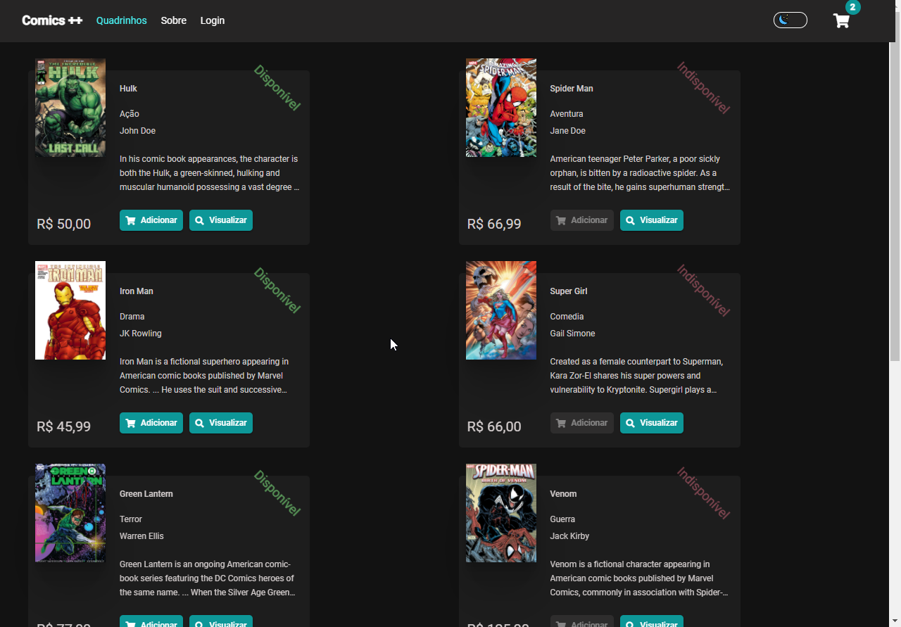
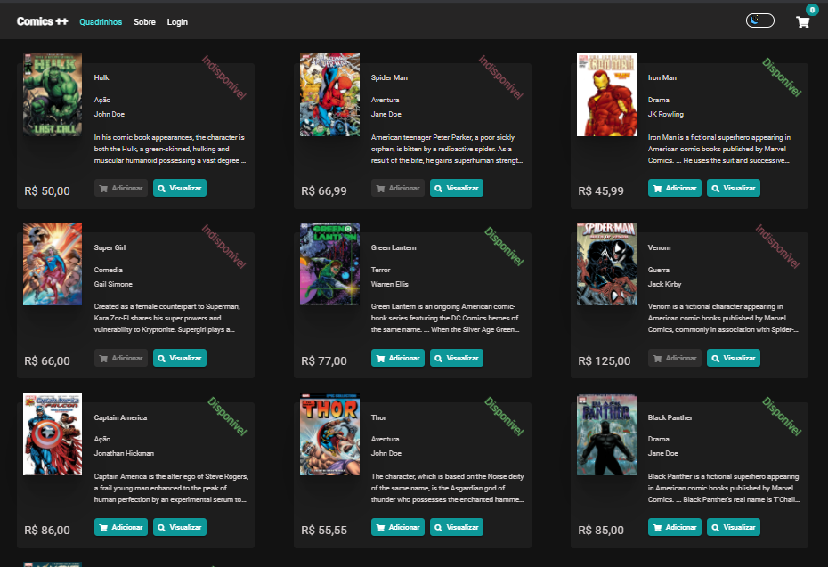
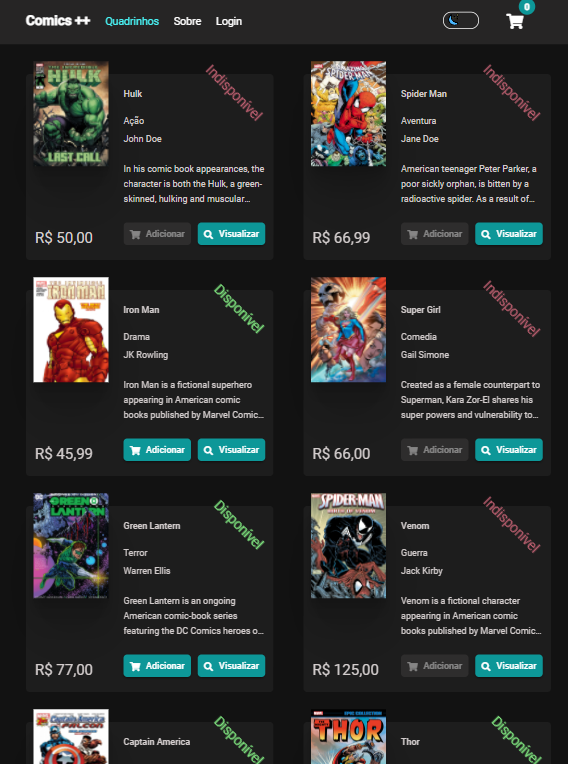
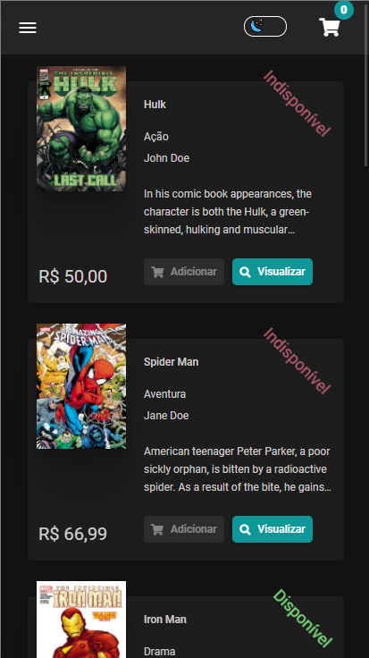

<div align="right">

[](https://app.netlify.com/sites/comics-plus-plus/deploys)

<div align="right">

[](README.md) [](README-PT.md)

</div>

</div>

<p align="center">
  
</p>

<p align="center"> 
  
  
       
  <a href="https://github.com/gleisonkz">
    
  </a>    
  
</p>

<p align="center">
 <a href="#eye_speech_bubble-visualizar">Visualizar</a> •
 <a href="#information_source-sobre">Sobre</a> •
 <a href="#arrow_forward-executar">Executar</a> •
 <a href="#hammer_and_wrench-tecnologias">Tecnologias</a> • 
 <a href="#sparkles-funcionalidades">Funcionalidades</a> •
 <a href="#boy-autor">Autor</a> •
 <a href="#balance_scale-licença">Licença</a>
</p>

---

## :eye_speech_bubble: **Visualizar**

<div align="center">

Deploy do front-end efetuado no [Netlify](https://www.netlify.com/) para visualizar: [Clique Aqui](https://comics-plus-plus.netlify.app/)
Deploy da API efetuado no [Heroku](https://www.heroku.com/) para visualizar: [Clique Aqui](https://kz-comic-store.herokuapp.com/index.html)

### :desktop_computer: Computer

|                                        Desktop                                        |                                        Ultra Wide                                        |
| :-----------------------------------------------------------------------------------: | :--------------------------------------------------------------------------------------: |
| <kbd></kbd> | <kbd></kbd> |

### :iphone: Responsive

|                                        Tablet                                        |                                        Mobile                                        |
| :----------------------------------------------------------------------------------: | :----------------------------------------------------------------------------------: |
| <kbd></kbd> | <kbd></kbd> |

</div>
  
---
## :information_source: Sobre

<div align="center">

E-commerce de quadrinhos desenvolvido para um teste de uma vaga como .NET full-stack, nesta aplicação é possível realizar todas as operações de CRUD para os quadrinhos, autores e categorias, controle de estoque, autenticação e autorização de recursos.

</div>

---

## :arrow_forward: **Executar**

<div align="center">

Para executar esse projeto você precisa baixar este repositório, ter o Gerenciador de Pacotes do Node ([`NPM`](https://www.npmjs.com/get-npm)) ou o Gerenciador de Pacotes YARN ([`YARN`](https://yarnpkg.com/getting-started)) instalado.

Abra o prompt de comando no diretório do projeto, e execute os seguintes códigos:

<details>
  <summary><i>com <b>npm</b></i></summary>
  
  ```bash
  # Instalar dependências
  $ npm install ou npm i

# Iniciar o servidor de desenvolvimento

$ ng serve --open ou ng s -o

````

</details>

<details>
<summary><i>com <b>yarn</b></i></summary>

```bash
# Instalar dependências
$ yarn install

# Iniciar o servidor de desenvolvimento
$ ng serve --open ou ng s -o

````

</details>

> ⚠️ O servidor de desenvolvimento será iniciado na porta: 4200 - Acesse <http://localhost:4200>

</div>

---

## :hammer_and_wrench: **Tecnologias**

<div align="center">

Tecnologias, abordagem, padrões e pacotes utilizados para desenvolver esta aplicação.

|                            :globe_with_meridians: FrontEnd                             |                                                     :file_cabinet: BackEnd                                                     |
| :------------------------------------------------------------------------------------: | :----------------------------------------------------------------------------------------------------------------------------: |
|                           [Angular 10](https://angular.io/)                            |                                 [.NET Core 3.1 Web API](https://dotnet.microsoft.com/download)                                 |
|                [Angular Material 10.2.7](https://material.angular.io/)                 |                                     [C#](https://docs.microsoft.com/en-us/dotnet/csharp/)                                      |
|    [Angular Flex-Layout 11.0.0](https://www.npmjs.com/package/@angular/flex-layout)    |                              [Entity Framework Core 5](https://docs.microsoft.com/en-us/ef/core/)                              |
|         [@auth0/angular-jwt](https://www.npmjs.com/package/@auth0/angular-jwt)         |                      [SQL Server](https://docs.microsoft.com/en-us/sql/sql-server/?view=sql-server-ver15)                      |
|              [RxJS 6.5](https://rxjs-dev.firebaseapp.com/guide/overview)               |                                                         Nuget Packages                                                         |
|                             [SASS](https://sass-lang.com/)                             |         [EntityFrameworkCore 5.0.0](https://www.nuget.org/packages/Microsoft.EntityFrameworkCore/5.0.0?_src=template)          |
|               [Flexbox](https://www.w3schools.com/css/css3_flexbox.asp)                |        [EF Core.Design 5.0.0](https://www.nuget.org/packages/Microsoft.EntityFrameworkCore.Design/5.0.0?_src=template)         |
|               [Grid Layout](https://www.w3schools.com/css/css_grid.asp)                |       [EF Core.Proxies 5.0.0](https://www.nuget.org/packages/Microsoft.EntityFrameworkCore.Proxies/5.0.0?_src=template)        |
|                      [BEM Methodology](http://getbem.com/naming/)                      |         [EF Core.Tools 5.0.0](https://www.nuget.org/packages/Microsoft.EntityFrameworkCore.Tools/5.0.0?_src=template)          |
|            [Cep Promise 4.0.4 ](https://www.npmjs.com/package/cep-promise)             |            [EF Core.SqlServer 5.0.0](https://www.nuget.org/packages/Microsoft.EntityFrameworkCore.SqlServer/5.0.0)             |
|                   [TypeScript 3.9](https://www.typescriptlang.org/)                    | [EF Core Identity 5.0.0](https://www.nuget.org/packages/Microsoft.AspNetCore.Identity.EntityFrameworkCore/5.0.0?_src=template) |
|                                      NGX Packages                                      |                          [Predicate Builder 1.0.0](https://www.nuget.org/packages/PredicateBuilder/)                           |
|               [Ngx Mask 11.1.4](https://www.npmjs.com/package/ngx-mask)                |        [Newtonsoft 3.1.10](https://www.nuget.org/packages/Microsoft.AspNetCore.Mvc.NewtonsoftJson/3.1.10?_src=template)        |
|   [Ngx Mat Select Search 3.1.4](https://www.npmjs.com/package/ngx-mat-select-search)   |     [JwtBearer 3.1.10](https://www.nuget.org/packages/Microsoft.AspNetCore.Authentication.JwtBearer/3.1.10?_src=template)      |
| [Ngx Material File Input 2.1.1](https://www.npmjs.com/package/ngx-material-file-input) |           [Swashbuckle.AspNetCore 5.6.3](https://www.nuget.org/packages/Swashbuckle.AspNetCore/5.6.3?_src=template)            |
|                                                                                        |                                                                                                                                |

</div>

- Development Approach
  - DDD - Domain Drive Design
  - SOLID Principles
  - Application Layers:
    - 1 - Application
    - 2 - Domain
    - 3 - Services
    - 4 - Infrastructure
    - 5 - Shared
- Patterns and Resources Applied
  - Repository
  - Generic Repository
  - Generic Pagination
  - Unity Of Work
  - Facade
  - Factory
  - Command
  - Adapter

## :sparkles: **Funcionalidades**

|              :globe_with_meridians: FrontEnd              |                          :file_cabinet: BackEnd                          |
| :-------------------------------------------------------: | :----------------------------------------------------------------------: |
|              Aplicação de Temas Dark e Light              |                       Autenticação com JTW Bearer                        |
|               Rotas com controle de acesso                |                        JTW Bearer Authentication                         |
|             Armazenamento de imagens em cache             |                      Retorno de dados com paginação                      |
|     Componente Genérico de busca e filtro no servidor     |                         Documentação com Swagger                         |
|   DataSource<T> customizado para paginação server side    | Conversor de Json customizado para mapear Interface para tipos concretos |
| Generic Dropdown Component with server side search filter |                     Validação de Models customizada                      |
|   Classe customizada para validação nos Reactive Forms    |           Contexto do Identity separado do Contexto do Domain            |
|               Componente de Dialog Genérico               |                             Testes Unitários                             |

---

## :boy: **Autor**

<div align="center">

<a href="https://github.com/gleisonkz">
 
 <br/>
 <sub><b>Gleison de Almeida</b></sub>
</a>

Desenvolvido com ❤️ por Gleison Almeida 👋🏽 Meus Contatos!

[](https://www.linkedin.com/in/gleison-ribeiro-a65257119)
[](https://github.com/gleisonkz)
[](mailto:gleisonsubzerokz@gmail.com)

</div>

---

## :balance_scale: **Licença**

<div align="center">

Copyright © 2021 [Gleison Almeida](https://github.com/gleisonkz).<br />
This project is licensed by [MIT](./LICENSE).

</div>
